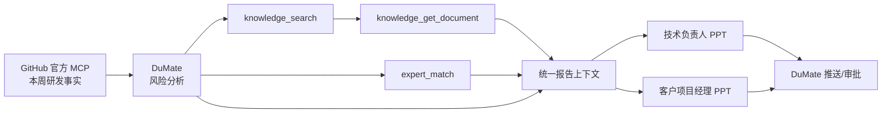

# ShopFlow 知识专家 MCP 工具说明

公网地址：`https://www.demofun.online/mcp`

协议：MCP Streamable HTTP、无状态 JSON 响应。当前知识和人员均为模拟数据，公网权限
主体为 `principal_delivery`。

## 1. 服务职责

本服务只提供两类能力：

1. 固定领域知识库：搜索已发布知识并读取授权正文。
2. 领域专家匹配：根据风险标签和受影响模块推荐企业专家。

GitHub 仓库、Issue、PR、Commit、Diff、Review、CI 和 Release 均由 GitHub 官方 MCP
读取；报告生成、PPT 渲染、定时任务和推送均由 DuMate 负责。

## 2. 暴露工具

MCP 连接后只应发现以下 3 个底层工具：

| 工具 | 输入 | 主要输出 | 作用 |
|---|---|---|---|
| `knowledge_search` | `query`，可选 `document_type` | 文档 ID、标题、类型、版本、标签、来源、匹配分 | 搜索当前 principal 有权读取的已发布知识 |
| `knowledge_get_document` | `document_id`，可选 `max_chars` | 授权正文摘要、版本、分类、来源、内容哈希 | 读取搜索命中的知识证据 |
| `expert_match` | `risk_tags`，可选 `modules` | 专家、领域、模块、匹配原因、状态、升级条件 | 将代码和交付风险路由给领域专家 |

知识库在业务上是一个接口，但 MCP 将“搜索”和“读取正文”拆成两个工具，以减少不必要
的正文暴露，并让服务端在读取阶段再次执行权限校验。

## 3. 知识库工具

### `knowledge_search`

输入示例：

```json
{
  "query": "inventory concurrency oversell",
  "document_type": "architecture-standard"
}
```

`document_type` 可以省略。工具只返回匹配文档的元数据，不直接返回正文。典型搜索主题：

- 库存并发：`inventory concurrency oversell atomicity`
- 购物车性能：`cart inventory performance n+1 batch`
- 管理端安全：`admin security rbac audit inventory`
- 发布门禁：`release quality-gate blocker customer`

### `knowledge_get_document`

输入示例：

```json
{
  "document_id": "kb-inventory-concurrency-v1",
  "max_chars": 4000
}
```

调用方应先搜索，再读取最相关文档。结果中的版本、`source_url` 和 `content_hash` 应随
风险结论写入报告，避免把模型常识误写成企业制度。

公网 `principal_delivery` 可以读取内部工程规范和公开发布 SOP，但不能读取 restricted
事故复盘正文。正式上线需把固定 principal 替换为 DuMate 用户到企业身份的映射。

## 4. 专家匹配工具

### `expert_match`

输入示例：

```json
{
  "risk_tags": ["inventory", "concurrency", "oversell"],
  "modules": ["inventory-reservation"]
}
```

工具按领域标签和负责模块计算匹配分，返回匹配原因、可用状态和升级条件。DuMate 应从
GitHub Diff 和风险分析中提取标签与模块，再调用此工具；不得把 Prompt 或通用代码 Skill
表述为企业人员专家。

当前目录中的四名人员均为案例数据。企业上线时应连接 SSO/通讯录、代码所有权、排班
和升级策略。

## 5. 推荐调用链



## 6. 已删除的接口

以下接口已从公网 MCP 删除，不应再出现在 DuMate 的工具列表中：

```text
delivery_build_snapshot
delivery_get_issue
delivery_generate_reports
delivery_simulate_push
```

原因是它们复制了 GitHub 实时数据或 DuMate 报告能力，容易让 Agent 混用历史案例和当前
状态。仓库中的场景数据和历史 PPT 仅作为开发案例证据，不属于 MCP 契约。
