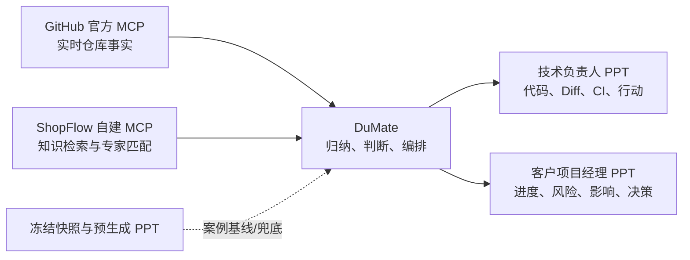

# ShopFlow 自建 MCP 工具说明

公网地址：`https://www.demofun.online/mcp`

协议：MCP Streamable HTTP、无状态 JSON 响应。当前数据全部为模拟数据，公网主体为
`principal_delivery`。本服务不替代 GitHub 官方 MCP。

## 1. 工具总览

| 工具 | 输入 | 主要输出 | 公网数据来源 | 推荐用途 |
|---|---|---|---|---|
| `delivery_build_snapshot` | 无 | 项目、指标、Issue、PR、Diff、证据 URL、快照 ID | 仓库内冻结快照 | 可重复案例基线，不用于获取 GitHub 实时状态 |
| `delivery_get_issue` | `issue_key` | 单个模拟 Issue 的状态、负责人、评论 | 冻结快照 | 定点讲解 `BUG-102` 等历史案例 |
| `knowledge_search` | `query`，可选 `document_type` | 知识标题、类型、版本、标签、来源、匹配分 | `knowledge/manifest.json` 和已发布文档 | 根据代码风险查找企业规范、SOP 和复盘 |
| `knowledge_get_document` | `document_id`，可选 `max_chars` | 授权文档摘要、版本、分类、内容哈希 | 已发布知识文档 | 读取检索命中的知识证据 |
| `expert_match` | `risk_tags`，可选 `modules` | 专家、领域、模块、匹配原因、升级条件 | 模拟专家目录 | 把风险路由给领域专家，而不是让 Prompt 冒充专家 |
| `delivery_generate_reports` | 无 | 快照 ID、两份 PPT 名称和 URL、状态 | 仓库内预生成 PPT | 获取案例制品；公网不会现场生成 PPT |
| `delivery_simulate_push` | 无 | 两个受众的推送预览和状态 | 预生成 PPT 元数据 | 演示推送编排；公网不会真实发送消息 |

## 2. 每个工具的详细含义

### `delivery_build_snapshot`

公网调用返回 `output/snapshots/snapshot-2026-08-06.json`。它固定了一个历史风险时点，
用于每次演示都得到相同的 `shopflow-fcbc6c1cd435`、65% 加权进度和 `BUG-102`
阻塞结论。本地模式才会读取场景 Git refs、重新计算 Diff 并写快照。

这个工具不会调用 GitHub 官方 MCP，也不会自动读取 GitHub 当前状态。真实周报应由
DuMate 调用 GitHub 官方 MCP 获取实时对象，再在 Agent 上下文中形成新的证据表。

### `delivery_get_issue`

输入示例：

```json
{"issue_key": "BUG-102"}
```

它只查询冻结案例中的业务键，如 `FEAT-101`、`BUG-102`、`PERF-104`。GitHub 上的
实时 Issue 应通过 GitHub 官方 MCP 按仓库和 Issue number 查询。

### `knowledge_search` 与 `knowledge_get_document`

典型调用顺序：

```text
GitHub Diff 显示 inventory.py 并出现并发超卖风险
  -> knowledge_search("inventory concurrency oversell")
  -> knowledge_get_document("kb-inventory-concurrency-v1")
```

搜索结果只返回元数据；读取正文需要第二个工具。服务端根据 principal 做 ACL，公网
`principal_delivery` 可读内部规范和公开发布 SOP，但不可读 restricted 事故复盘正文。

### `expert_match`

输入示例：

```json
{
  "risk_tags": ["inventory", "concurrency", "oversell"],
  "modules": ["inventory-reservation"]
}
```

结果是基于领域标签和负责模块的确定性匹配。当前四名专家均为模拟人员；企业上线时
应替换为 SSO/通讯录、真实负责关系和排班数据。

### `delivery_generate_reports`

这个名称包含两种运行模式：

| 运行环境 | 实际行为 |
|---|---|
| 本地开发环境 | 读取冻结上下文，运行仓库内 Node/PPT 构建器，生成两份 PPTX |
| Vercel 公网环境 | 不生成文件，只返回仓库内两份预生成 PPT 的下载 URL，状态为 `pre_generated` |

因此它当前的主要作用是提供一个“固定黄金样例”，用于验证两份报告是否共用同一个
快照、比较 DuMate 生成结果和演示报告版式。它不是生产级在线 PPT 生成服务，也没有
接收 GitHub 官方 MCP 实时数据的输入参数。

如果 PPT 主要由 DuMate 原生能力生成，推荐的正式演示不调用此工具。DuMate 应使用
GitHub 官方 MCP 的实时事实，加上 `knowledge_*` 和 `expert_match` 的增强结果，直接
生成技术负责人版和客户项目经理版 PPT。预生成报告仅作为对照或失败兜底。

### `delivery_simulate_push`

公网只返回“将向两个受众交付哪些文件”的模拟结果，不会发送邮件、飞书消息或其他
外部通知。正式上线需要在推送前增加人工审核、目标人授权、审计和失败重试。

## 3. GitHub 官方 MCP 与自建 MCP 的职责



GitHub 官方 MCP 可以提供仓库、Commit、Issue、PR、Review、变更文件、检查和 Release
等实时事实。DuMate 可以据此找到本周更新并生成报告内容，但仍需在提示词或 Skill 中
定义以下业务规则：

- 以 Milestone/Issue 为计划基线，不用 Commit 数量代表业务进度。
- 区分事实、推断和待确认项。
- 识别未关联 Issue 的代码变化。
- 规定两个受众的信息边界和脱敏规则。
- 对风险调用企业知识和专家目录，而不是只依赖通用模型判断。

## 4. 当前限制与生产建议

- 公网快照是固定案例数据，与 GitHub 当前状态可能处于不同时间点，不能混成同一结论。
- 自建 MCP 当前没有“接收 GitHub 实时数据并生成 PPT”的工具契约。
- 公网不持久化文件、不运行 PPT 构建器、不真实推送。
- 正式方案中可保留 `knowledge_*` 和 `expert_match`，将 `delivery_*` 固定案例工具标记为
  Demo-only，避免 Agent 把历史快照当成实时数据。
